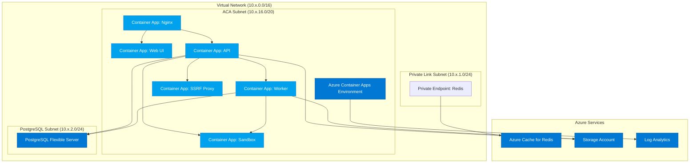

# cdktf-dify-on-azure

[dify Azure terraform](https://github.com/nikawang/dify-azure-terraform)を 個人の学習の為、cdktf で書き直してみたものです。

## Azure アーキテクチャ図



### コンポーネント構成

1. **Virtual Network**

   - ACA Subnet (10.x.16.0/20): Azure Container Apps の実行環境
   - Private Link Subnet (10.x.1.0/24): Private Endpoint の配置用
   - PostgreSQL Subnet (10.x.2.0/24): PostgreSQL サーバーの配置用

2. **Azure Container Apps**

   - Nginx: リバースプロキシ
   - Web UI: フロントエンド
   - API: バックエンド
   - Worker: 非同期処理用ワーカー
   - Sandbox: ユーザーのコード実行環境
   - SSRF Proxy: プロキシサービス

3. **データストア**

   - PostgreSQL Flexible Server: メインデータベース（PgVector 拡張機能付き）
   - Azure Cache for Redis: キャッシュおよびメッセージブローカー
   - Storage Account: ファイル保存, ファイル共有(マウント)

4. **監視**
   - Log Analytics: コンテナアプリのログ収集と分析

## デプロイ

install packages

```bash
npm ci
```

azure login

```bash
az login
```

export environment variables

```bash
export AZURE_SUBSCRIPTION_ID=xxxx-xxxx-xxxx-xxxx
export PROJECT_NAME=cdktftestdify
export POSTGRES_ADMIN_USER=postgres
export POSTGRES_PASSWORD=xxxxxxxx
```

deploy

```bash
npx cdktf deploy
```

## InfraCost での概算費用

infra cot login

```bash
infracost auth login
```

synth and breakdown

```bash
npx cdktf synth
infracost breakdown --path cdktf.out/stacks/cdktf-on-azure/
```

```
 Name                                                                          Monthly Qty  Unit                      Monthly Cost

 azurerm_redis_cache.redis_7140560C
 └─ Cache usage (Standard_C0)                                                            2  nodes                           $40.15

 azurerm_postgresql_flexible_server.postgres_30E79952
 ├─ Compute (B_Standard_B1ms)                                                          730  hours                           $18.98
 ├─ Storage                                                                             32  GB                               $4.42
 └─ Additional backup storage                                           Monthly cost depends on usage: $0.095 per GB

 azurerm_private_endpoint.redis_redis_pe_4F5E25C5
 ├─ Private endpoint                                                                   730  hour                             $7.30
 ├─ Inbound data processed (first 1PB)                                  Monthly cost depends on usage: $0.01 per GB
 └─ Outbound data processed (first 1PB)                                 Monthly cost depends on usage: $0.01 per GB

 azurerm_private_dns_zone.postgres_postgres_dns_EC151903
 └─ Hosted zone                                                                          1  months                           $0.50

 azurerm_private_dns_zone.redis_redis_dns_3E203D9D
 └─ Hosted zone                                                                          1  months                           $0.50

 azurerm_log_analytics_workspace.container_apps_log_analytics_BAA360C3
 ├─ Log data ingestion                                                  Monthly cost depends on usage: $3.34 per GB
 ├─ Log data export                                                     Monthly cost depends on usage: $0.15 per GB
 ├─ Basic log data ingestion                                            Monthly cost depends on usage: $0.73 per GB
 ├─ Basic log search queries                                            Monthly cost depends on usage: $0.00725 per GB searched
 ├─ Archive data                                                        Monthly cost depends on usage: $0.029 per GB
 ├─ Archive data restored                                               Monthly cost depends on usage: $0.15 per GB
 └─ Archive data searched                                               Monthly cost depends on usage: $0.00725 per GB

 azurerm_storage_account.fileshare_storage_account_5E47708B
 ├─ Capacity                                                            Monthly cost depends on usage: $0.02 per GB
 ├─ Write operations                                                    Monthly cost depends on usage: $0.05 per 10k operations
 ├─ List and create container operations                                Monthly cost depends on usage: $0.05 per 10k operations
 ├─ Read operations                                                     Monthly cost depends on usage: $0.004 per 10k operations
 ├─ All other operations                                                Monthly cost depends on usage: $0.004 per 10k operations
 └─ Blob index                                                          Monthly cost depends on usage: $0.0436 per 10k tags

 azurerm_storage_share.fileshare_share_nginx_6ED98AA8
 ├─ Data at rest                                                        Monthly cost depends on usage: $0.06 per GB
 ├─ Snapshots                                                           Monthly cost depends on usage: $0.06 per GB
 ├─ Read operations                                                     Monthly cost depends on usage: $0.0015 per 10k operations
 ├─ Write operations                                                    Monthly cost depends on usage: $0.015 per 10k operations
 ├─ List operations                                                     Monthly cost depends on usage: $0.015 per 10k operations
 └─ Other operations                                                    Monthly cost depends on usage: $0.0015 per 10k operations

 azurerm_storage_share.fileshare_share_sandbox_22736D98
 ├─ Data at rest                                                        Monthly cost depends on usage: $0.06 per GB
 ├─ Snapshots                                                           Monthly cost depends on usage: $0.06 per GB
 ├─ Read operations                                                     Monthly cost depends on usage: $0.0015 per 10k operations
 ├─ Write operations                                                    Monthly cost depends on usage: $0.015 per 10k operations
 ├─ List operations                                                     Monthly cost depends on usage: $0.015 per 10k operations
 └─ Other operations                                                    Monthly cost depends on usage: $0.0015 per 10k operations

 azurerm_storage_share.fileshare_share_ssrfproxy_925A43C9
 ├─ Data at rest                                                        Monthly cost depends on usage: $0.06 per GB
 ├─ Snapshots                                                           Monthly cost depends on usage: $0.06 per GB
 ├─ Read operations                                                     Monthly cost depends on usage: $0.0015 per 10k operations
 ├─ Write operations                                                    Monthly cost depends on usage: $0.015 per 10k operations
 ├─ List operations                                                     Monthly cost depends on usage: $0.015 per 10k operations
 └─ Other operations                                                    Monthly cost depends on usage: $0.0015 per 10k operations

OVERALL TOTAL                                                                       $71.85
```
